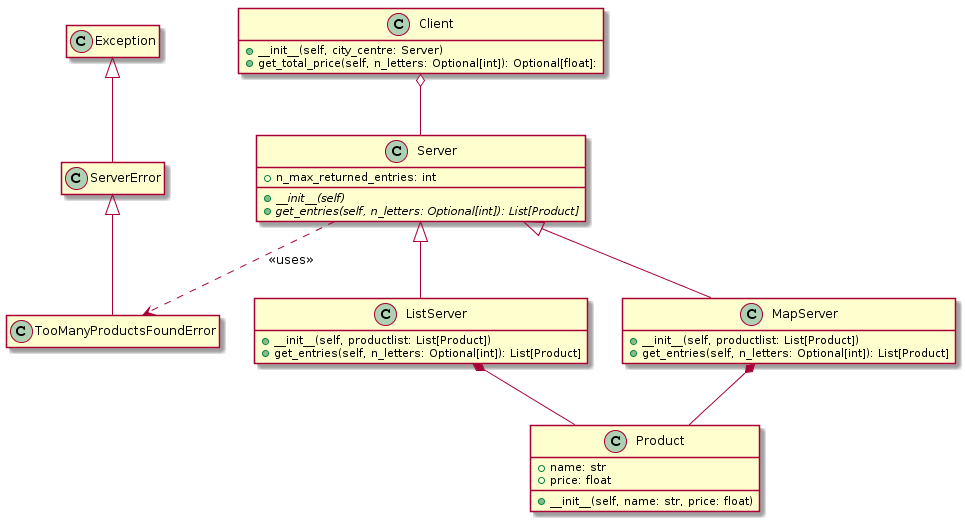

# Shop server simulation

----------
### The project is an implementation of following UML diagram.

The project has been created during studies on the Computer Science classes.

##What it has been created for?
The project is not very functional, but it shows the knowledge of certain practices.

1. It contains some relations between the classes, like:
- composition, 
- inheritance,
- aggregation,
- realization.

2. The class Server is completely abstractive.

3. There is also one regex implemented.

4. Unit tests

5. Implemented custom error

##Description
It is a very poor simulation of shop server.

Shop owner can init server with some products. 
Server can store products in a list (ListServer) or in a dict (MapServer).

Every server allows to store every amount of products, but there is defined 
numbers of products that client can get in one time.

The client can get some products and count the total price for them.
 At one time the client can only select products with a certain number of letters in 
the name. 

##Example

There are only 3 products on shop server:

Product 1 name: 'Pen1' 
Product 2 name: 'Car3' 
Product 3 name: 'Note3' 

The client want to get product with 3 letters. So he received the products 1 and 2, 
because 'Pen' and 'Car' has 3 letters in name.

## Warning!!!
At real the main file does nothing.
It has been created to easier manual testing and checking relations between classes.
